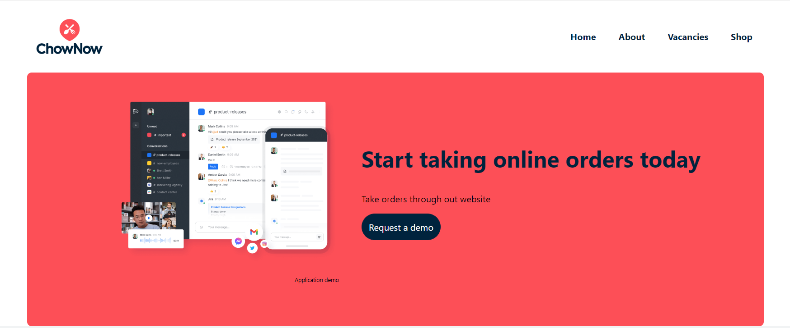
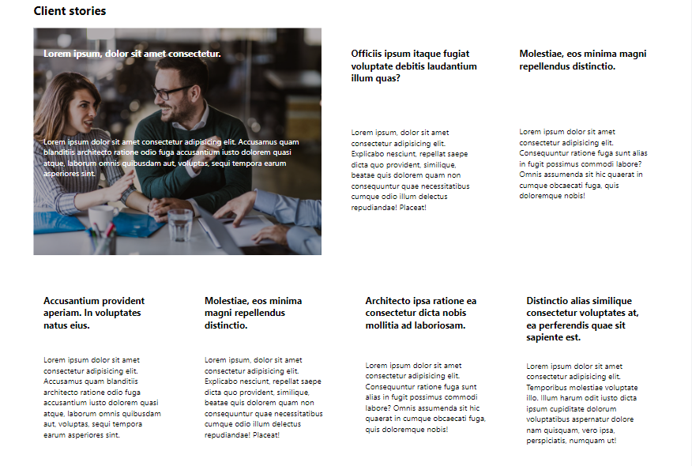
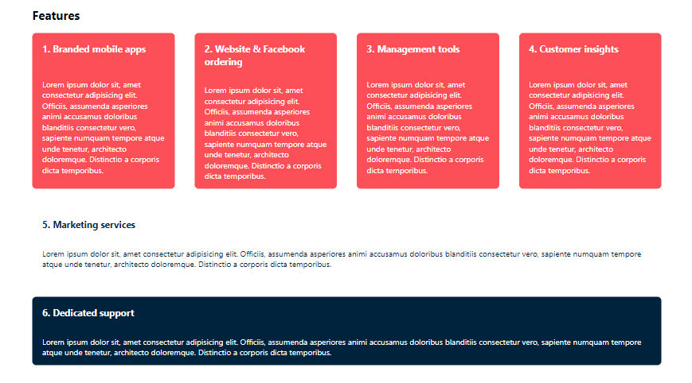
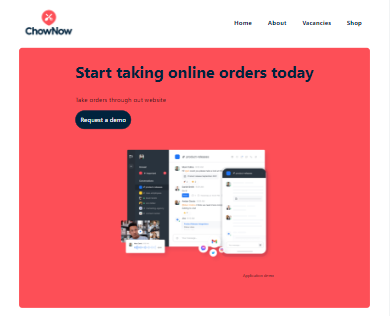

# CSS Flexbox

## Before we start

1. This practical task is verified automatically with tests. 
2. Please, put all your `CSS` code to the `src/style.css` file. If you use any other file, we would not be able to verify it.
3. Please, don't change the page structure, it may affect tests.

## Development

While you developing, you can simply open `src/index.html` in a browser for checking it. However, we prepared a more convenient way to run it locally, you can find all the details here - [Local Development](./docs/LocalDevelopment.md).

## Check your solution before submitting it (OPTIONAL)

To be sure you submit a correct solution, you can verify it locally. It requires some local setup. Here you can find a description of how to do it - [Verify your solution locally](./docs/VerifySolutionLocally.md)

## Task Requirements

This Task consists of 2 parts. In first part we propose you to find and fix invalid Flexbox properties usage for defined html elements. In second part, we ask you to change existing styles using CSS Flexbox features to follow the mockup.
Please, note you MUST add all CSS rules in the `src/style.css` file and not change the `src/index.html` file. We can't verify your solution if you use a different file. You don't need to add additional rulesets in `src/style.css`. Please, add required properties in existing rulesets.

### Fix invalid Flexbox properties
 - In `style.css` you need to find and fix flexbox properties, which are applied incorrectly for `<header>` and `<main>` containers. There should be 5 fixes

### Add proper CSS rules to required html elements to match mockups
   - Add `display` property to `nav ul` to make it flexible. After change applied, header and footer should match design.
   
   Header menu:
   
   Footer menu:
   

   - Add proper `flex-direction` to `<section class="title_section">` to match mockup. Pay attention on flex-items order.
   

   - Make every `
` in each `<section>` in`<main>` flexible. 
   
   - Implement changes to align "Client stories" section with mockup. Add `flex-grow` property to `.column` and `section:first-of-type div:first-of-type .column:first-of-type` with proper values. 
   

   - Implement changes for "Features" section to match provided mockup. Uncomment css rules for `.card-first`, `.card-second`, 
   ... `.card-six` selectors and fill them with proper values. Pay attantion on cards order and size.
   

   - Implement changes in footer to match provided design. Add `display, justify-content, align-items` properties in `footer` ruleset
   

### Make it responsive
  - Make the flex items in menu always stay on one line. Please make required changes in ruleset for `nav ul` selector
  - Make `<section class='title_section'>` wrap in 2 lines for small screens (if the elements do not fit on the screen). Please make required changes in ruleset for `.title_section`

  
